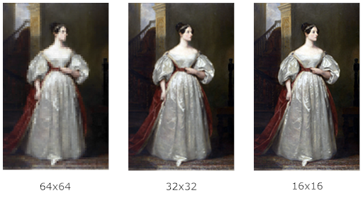

# mosaic demo

A demo involving the package's function where we
* create three mosaics of the 3604x5718 image of Ada Lovelace's portrait
(source: Wikimedia, https://upload.wikimedia.org/wikipedia/commons/8/87/Ada_Lovelace.jpg),
* use three different tile sizes, namely, 64x64, 32x32 and 16x16,
* save the mosaics in three diffferent image formats.



```go
package main
import(
    "github.com/ybeaudoin/go-mosaic"
)
func main() {
    mosaic.Truchet("../images/Ada_Lovelace.jpg", "Ada_Lovelace-Truchet64.gif", 64)
    mosaic.Truchet("../images/Ada_Lovelace.jpg", "Ada_Lovelace-Truchet32.png", 32)
    mosaic.Truchet("../images/Ada_Lovelace.jpg", "Ada_Lovelace-Truchet16.jpg", 16)
}
```

BTW, as of this writing, the portrait hangs in 10 Downing Street (http://www.bbc.com/news/uk-politics-37365509).


