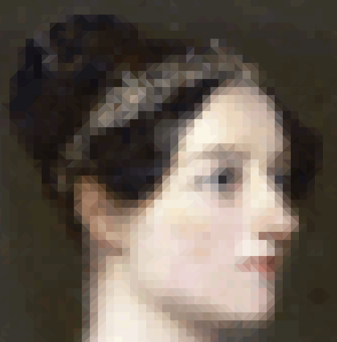
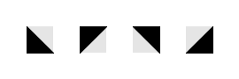

# mosaic

Go package for creating a mosaic of an image using Truchet tiles.

  
*Detail of the demo mosaic using 16x16 tiles on Ada Lovelace's portrait*

## Install

To install the package and the demo:
```sh
go get -u github.com/ybeaudoin/go-mosaic
```

The package imports nfnt's resize package which can be installed as follows:
```sh
go get -u github.com/nfnt/resize
```

## At a glance

The package exports the following:
 * Function:
   * `Truchet(inFile, outFile string, tileSide uint)`  
     Creates a mosaic of an image using Truchet tiles.

## *Truchet*'s Arguments

| Argument | Description |
| --- | --- |
|inFile|path of the image file to be processed|
|outFile|path for the resulting mosaic file|
|tileSide|side length in pixels for the square area occupied by a tile|

## Remarks

**Father Sebastian Truchet** (1657-1729) was a French Dominican priest "active in areas such as mathematics, hydraulics, graphics,
typography, and \[responsible\] for many inventions"<sup>[\[1\]](https://en.wikipedia.org/wiki/S%C3%A9bastien_Truchet)</sup>.
In 1704, he "considered all possible patterns formed by tilings of right triangles oriented at the four corners of a square"
<sup>[\[2\]](http://mathworld.wolfram.com/TruchetTiling.html)</sup>:



For our purposes, the tiles do not have a common background. The background colors are simply set as the average color of the
square source subarea in which a tile lies. As for the tile itself, the same scheme applies but only for the underlying area
covered by the actual tile.

A tile's interior boundary is readily established using the parametric equation for a line segment, namely,  
x = x<sub>1</sub> + &lambda;(x<sub>2</sub>-x<sub>1</sub>),  
y = y<sub>1</sub> + &lambda;(y<sub>2</sub>-y<sub>1</sub>),  
with &lambda;&isin;[0,1] and where (x<sub>1</sub>,y<sub>1</sub>) and (x<sub>2</sub>,y<sub>2</sub>) are the coordinates of the
end points. 

Given that the algorithm proceeds in a top-down, left-to-right fashion, the (x<sub>1</sub>,y<sub>1</sub>) and
(x<sub>2</sub>,y<sub>2</sub>) end points are set to represent the top and bottom opposite corners respectively of the subarea.
The value of &lambda; is then driven by the row value y<sub>row</sub> so that  
&lambda; = (y<sub>row</sub>-y<sub>1</sub>) / (y<sub>2</sub>-y<sub>1</sub>).  
Substituting this value into the x-equation yields the x-ordinate of the corresponding boundary
point. Determining whether a given source pixel on the row lies in the background area is then just a matter of checking whether
its x value is to the left or right of the boundary x-value for a given tile type.

Which leaves the question of which tile to use? We opted to pick a tile based on the largest color gradient from the
center of the source subarea to one of its corners. In the eyes of this beholder, the method appears to soften the transition
between lighter and darker areas. For example, in the above image, the tiles along her hair line all point in the same direction
and add an intermediate color between adjacent subareas.

Package mosaic supports GIF, JPEG and PNG files. The image format for the resulting mosaic is governed by the specified
case-insensitive extension of the output file., i.e., ".gif", ".jpg", ".jpeg", or ".png". The encodings are
lossless but keep in mind that dithering occurs with the GIF format when the number of colors exceeds 256 colors.

## Reference

1. https://en.wikipedia.org/wiki/S%C3%A9bastien_Truchet
2. http://mathworld.wolfram.com/TruchetTiling.html

## MIT License

Copyright (c) 2016 Yves Beaudoin webpraxis@gmail.com

See the file LICENSE for copying permission.


